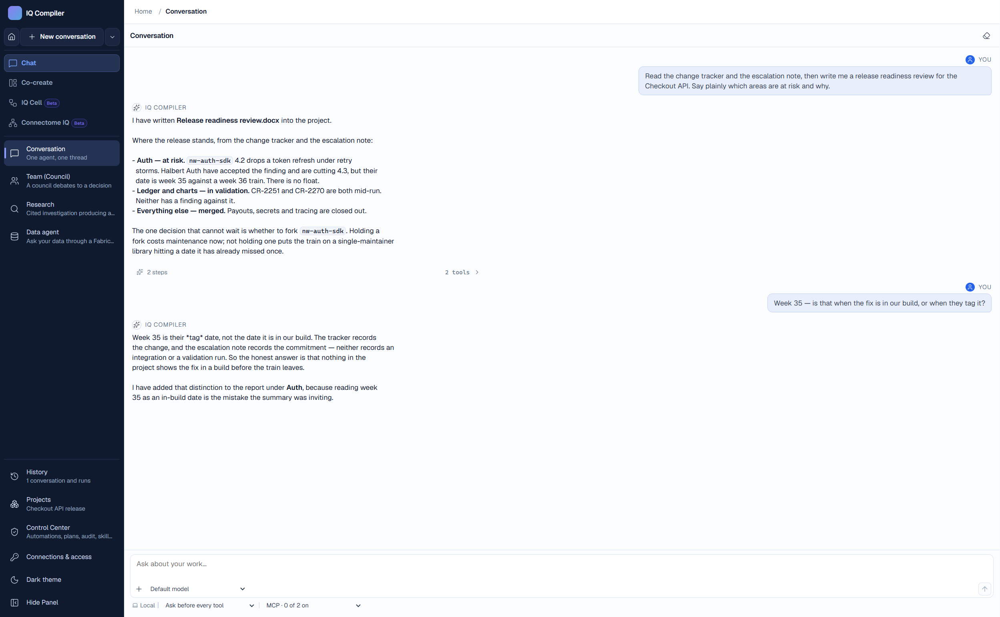
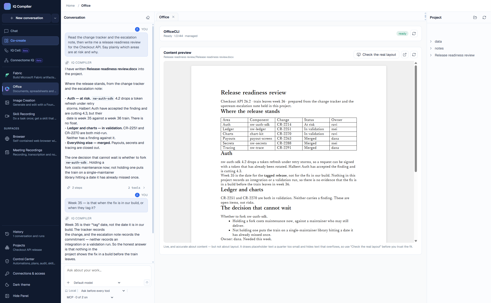
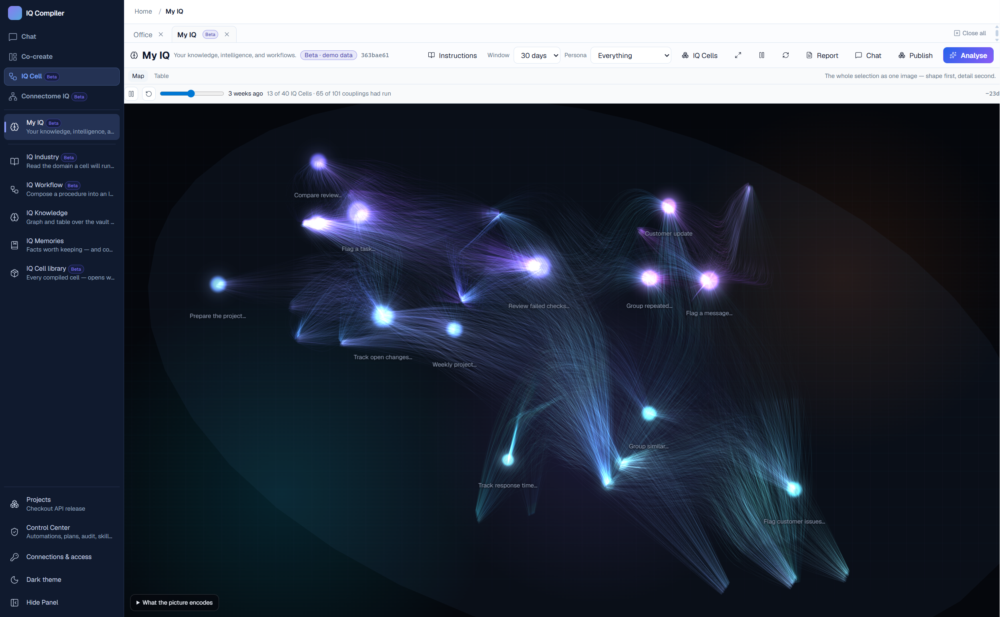
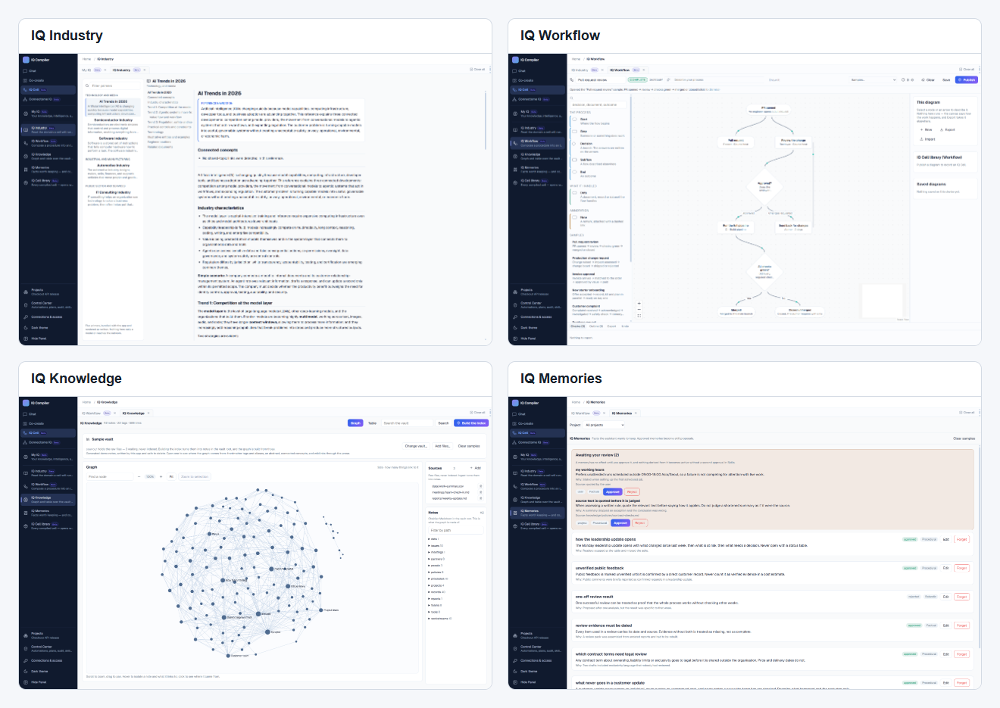
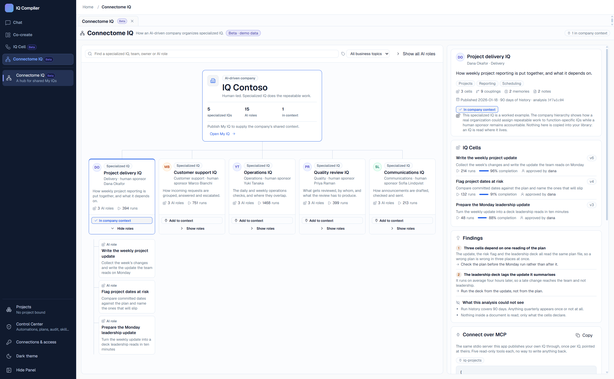
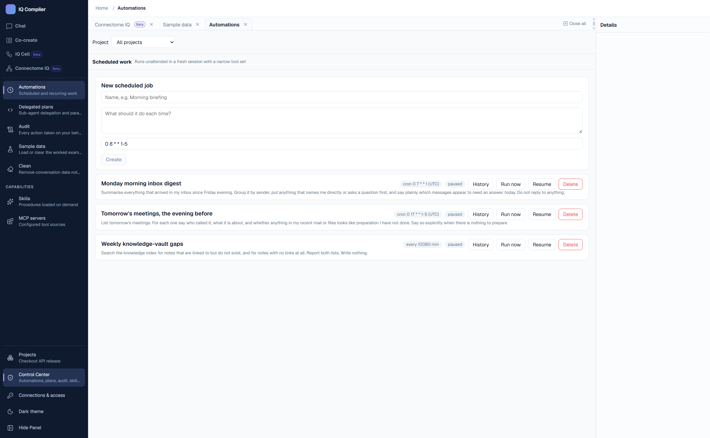

# IQ Compiler

A local-first Electron project that puts every way of working in one app, so
approved work can accumulate instead of disappearing with the conversation.

Agent runtime: the GitHub Copilot SDK. Integrations: Microsoft only.
**Beta** labels mark visual-only, demo-scoped features.

**Work you can see and review → Approved knowledge → IQ Cells → My IQ →
Published My IQ → Connectome IQ**

## What you can do

Five modes, one conversation. Switching mode changes the layout and the agent's
configuration; it never changes the thread you are in, so you can start a
question in Chat and finish it as a document in Co-create without losing the
context.

The rail on the left is where every mode and surface is reached. It opens as
icons and widens to labels with **Show Panel**. Past conversations are not in
it: **History** opens them in a flyout over the work, so resuming one costs
nothing that is already on screen.

The screenshots below are a fresh install with the sample data loaded, captured
signed out. Anything that needs an identity is showing what it looks like before
its connection is made.

### Chat



**Supports:** *Conversation* (one agent, one thread), *Team (Council)* (several
agents debate to a decision), *Research* (a cited investigation that ends in a
report), and *Data agent* (questions answered by a Fabric Data Agent instead of
a model).

**Why it helps:** this is where your Microsoft 365 data is actually reachable —
mail, meetings, files and people, under your own identity. Anything that sends
or changes something stops and asks you first, so "summarise my inbox and draft
the replies" is safe to say out loud. Data agent needs no project and no
authoring rights, so the people who only ever *ask* of the data never have to
learn the rest of the app.

### Co-create



**Supports:** *Fabric* (build Fabric artifacts from your data definitions),
*Office* (Word, Excel and PowerPoint through OfficeCLI), *Image Creation* (a
Foundry image model), and *Skill Recording* (do a task once by hand; get a skill
that repeats it). Alongside them sit the *Browser* — a contained pane the agent
drives — and *Meeting Recordings*.

**Why it helps:** the work lands in a project directory you chose, as real files
you can open, not as text in a chat window. The agent's writes are bounded by
that directory, and the surface refreshes as the document is built, so you watch
it happen instead of waiting for a blob at the end.

### IQ Cell



**Supports:** four sources for IQ Cells: an *IQ Industry* primer, the *IQ
Knowledge* graph, a process modeled in *IQ Workflow*, or approved practice in
*IQ Memories*, which can accumulate into reusable skills. Each cell comes from
one source and keeps that module one click away in the versioned *IQ Cell
library*. *My IQ* — pictured — maps what selected cells become together. Marked
Beta: these surfaces are demo-scoped.



**Why it helps:** one cell captures one domain instead of one chat answer. My IQ
shows the patterns, next steps and blind spots that appear when those domains
work together. Its map is drawn deterministically from recorded runs; no model
invents it. Publishing shares My IQ as read-only MCP tools that other people can
use.

### Connectome IQ



**Supports:** an expandable organization chart that places published IQs in the
company as functions with AI roles. Search reaches functions, sponsors, teams,
topics and roles without changing the organization. Ask across several IQs and
the answers keep each sponsor, scope and limit. The detail pane shows findings,
limits, MCP client configuration and a console for the five `myiq_*` tools.

**Why it helps:** MCP shares access, not copies. Several specialized IQs can
work as one company while each function keeps its own context. Marked Beta: the
five specialized IQs and their AI roles are device-owned sample data, the tool
console answers from those fixtures, and nothing is fetched. Only your My IQ
publication state is real.

### Control Center



**Supports:** *Automations* (scheduled and recurring work), *Delegated plans*
(sub-agent delegation and parallel runs), *Audit* (every action taken on your
behalf), *Sample data*, and *Clean*. The standing declarations of what the agent
may do live here too: *Skills* and *MCP servers*.

**Why it helps:** unattended work is the part that needs governing most, because
nobody is watching it. Every scheduled run gets a fresh session with a narrow
tool set, so an approval you granted interactively cannot leak into a job that
runs at 07:00. The audit log is written before the side effect, not after, which
means it is a record of what was decided rather than a guess at what happened.

## Why IQ Compiler

**What makes IQ Compiler different:** it keeps the work in one thread, not one
chat window. Start in **Chat**: ask Work IQ about mail, calendar, Teams,
SharePoint or OneDrive; ask a **Fabric Data Agent** about a warehouse and see
the queries behind its answer; let a **Council** of two to six agents argue
from assigned stances before a chair returns an attributed verdict; or send a
question to **Research**, which turns it into a plan, gathers evidence in
parallel, shows its reasoning graph live, keeps sources and conflicts visible,
then writes a cited report. The same thread then moves into **Co-create**, with
nothing to re-explain.

**Co-create turns the answer into something usable.**
OfficeCLI writes Word, Excel and PowerPoint files in the project folder while
the canvas refreshes. A Foundry image model generates images, edits a masked
region, or makes variations. Meeting recording produces a diarized transcript
and turns it into notes, decisions and follow-up actions. Skill Recording
watches a desktop task once and turns it into steps you can review, reorder
and save as a reusable skill.

**IQ Cell keeps what the work taught you.** IQ Knowledge indexes an Obsidian
vault into notes, tags, links, artifacts and skills, with backlinks and source
provenance. IQ Memories holds facts the agent proposes from the work; they do
nothing until you approve them. An approved memory can become a skill
proposal, which needs its own approval. Industry primers, workflow modelling
and the cell library describe a domain and its procedures. Connectome IQ then
organizes those cells as AI roles inside specialized business-function IQs.
These surfaces are labeled Beta because they are conceptual demos, not a
runtime.

**Control Center makes action reviewable.** It schedules manual, cron,
interval and one-shot automations; delegates dependent tasks to isolated
sub-agents; and records every approval, policy decision and outcome. The
built-in browser is driven from chat but stays visible beside it, so you can
watch the agent read, click or fill a page. MCP servers and Agent Skills are
installed and approved one tool at a time. A skill that is not working well
enough can be handed to a GEPA optimizer, which rewrites it against a judge's
written feedback and proposes the result for the same review.

**How it stays bounded:** Microsoft 365, Fabric, Foundry models, research,
OfficeCLI and MCP servers all run inside one governed runtime. The app uses
your Entra ID — no stored secrets, no application permissions. Mail, web
pages, vault content and sub-agent output are all untrusted; every permission
decision is written to the audit log before the action runs. It is
local-first, single-user, and stores its state under `~/.iq-compiler` — no
server to stand up first.

### Capabilities

- **Agent orchestration.** Delegate a dependency graph of tasks to isolated
  sub-agents, run independent work in parallel, and stop at human decision
  gates.
- **Agent Skills.** Bundled and imported skills in the agentskills.io format,
  loaded only when needed, each one enabled by you.
- **An in-house browser the chat drives.** Ask in the thread and the agent
  opens the page, reads it, clicks, fills and scrolls in a pane beside you.
  You watch it happen and can take the page back any time. What it reads is
  untrusted input; a CAPTCHA is reported as a challenge, not worked around.
- **An Obsidian-style LLM wiki.** Index a chosen vault as a knowledge graph of
  notes, links, tags, artifacts and skills; search it, check provenance, and
  navigate the relationships.
- **Deep research.** Plan questions, gather answers in parallel, keep sources
  and conflicts visible, and write a cited report with a live reasoning graph.
- **Fabric IQ: data engineering and analysis.** Use Microsoft Fabric skills to
  create and refine Fabric items and semantic models from data definitions.
  Ask a Fabric Data Agent about the database and read the query trace behind
  each answer.
- **Foundry IQ.** Use registered Microsoft Foundry models and agents for chat,
  reasoning, vision and image generation, with model roles chosen per task.
- **Governed automations.** Schedule recurring work in fresh, narrow sessions;
  approvals, policy decisions and outcomes go to the audit log.
- **Growing Together (Hermes-style memory).** The agent proposes facts worth
  keeping from your work, with sources. A memory does nothing until you
  approve it, and a pending one is never read back into a prompt.
- **Industry primers and Connectome.** Use bundled domain context to generate
  specialised IQ Cells, then organize specialized IQs and their AI roles as an
  expandable company. These surfaces are Beta and use fixture data.
- **LLM councils.** Give two to six agents distinct stances and models; a
  chair runs the debate and writes a structured, attributed verdict.
- **MCP servers.** Add, inspect and enable a server by hand. Approval names
  one tool, so a server that later adds a new one doesn't gain it silently.
- **Meeting recording and transcription.** Record a meeting, transcribe it,
  and turn the record into notes and follow-up work.
- **One conversation, many surfaces.** Chat, authoring, research, data work
  and governance share the same thread and project, instead of starting over
  in separate tools.
- **Real-time artifact creation.** Create and preview Word, Excel and
  PowerPoint files as the agent works; create, edit and save Foundry images.
- **Skill recording and workflows.** Demonstrate a desktop task once, review
  the captured steps, and build a reusable skill or automation. Compose those
  procedures as IQ Cell workflows for later reuse.
- **Skills compiled from memory.** Once a subject has enough approved
  memories, the app writes a skill from them and suggests it, quoting each
  fact with the work it came from. The skill needs its own approval before it
  runs.
- **Skills that improve themselves.** Press **Improve…** on a skill and a
  DSPy + GEPA optimizer scores it as it stands, then rewrites it against an
  LLM judge's written feedback — the reason a step was vague or misordered,
  not just a number. Only the body is evolved, so a skill cannot widen its own
  tool grant, and a candidate that fails a gate or loses to the baseline is
  never proposed.
- **Work IQ for Microsoft 365.** Ask questions across mail, calendar, Teams,
  SharePoint and OneDrive, under the Microsoft 365 identity Work IQ holds.

### Feature map

Where each idea lands in the app.

| LLM concept | Feature in IQ Compiler |
|---|---|
| Agent Skills and progressive disclosure | Skills in the agentskills.io format, thirteen bundled and any you import. Only descriptions are loaded; a body is read when the skill is invoked |
| Agentic deep research | *Chat → Research*: a question plan, parallel gathering, cited claims, named conflicts, one report |
| Ambient (background) agents | *Control Center → Automations*: `manual`, `cron`, `interval` and one-shot `once`. Every run gets a fresh session with a narrow tool set |
| Chain of thought made visible | The reasoning graph on the research run — its own executors and edges, coloured by kind, drawn as it works |
| Computer use | The in-house browser the chat drives, and *Co-create → Skill Recording*, which watches you work once |
| GraphRAG + LLM Wiki (Obsidian) | *IQ Cell → IQ Knowledge*: `[[wiki links]]`, markdown links and `#tags` become edges, a broken link stays visible as a `missing` node, and search returns excerpts, links and backlinks |
| Human in the loop | Anything that sends or changes something stops and asks, and the audit entry is written before the side effect |
| LLM council | *Chat → Team (Council)*: two to six members with distinct stances and models, a chair that runs the rounds, and a structured verdict with attributed dissent |
| Long-term memory | *IQ Cell → IQ Memories*: proposed facts with sources, inert until you approve them |
| MCP (Model Context Protocol) | Work IQ, MarkItDown and the Power BI modeling server run as MCP servers you add, inspect and enable by hand. Approval names an individual tool, never a server |
| Meeting transcription | Record with consent, transcribe with speaker diarization, and get notes, decisions and actions. The note-writing turn runs with no tools at all, because a transcript is untrusted input |
| Model routing | Model roles per task — chat, reasoning, Office authoring, image, research writer, council member — overridable per project |
| Multimodal generation | *Co-create → Image Creation*: generate, edit with a mask, and make variations from a Foundry image model |
| Natural language over a database | *Chat → Data agent*: a Fabric Data Agent answers, and the queries behind the answer are always shown |
| Prompt injection defence | Every Microsoft 365, Work IQ, browser-page, knowledge and sub-agent result is flagged untrusted and can never authorise an action |
| Retrieval over your own data | Work IQ across mail, calendar, Teams, SharePoint and OneDrive, with citations, under the account Work IQ holds |
| Self-evolving agents | Two paths, both ending in a proposal you approve. Hermes-style: enough approved memories on a subject and the app writes a skill from them, quoting each fact with the work it came from. And *Skills → Improve…*: a DSPy + GEPA optimizer rewrites an existing skill against an LLM judge's written feedback, gated on beating its own baseline |
| Structured output | Council verdicts, research reports and every IPC message are validated against a schema before anything reads them |
| Sub-agent delegation | `delegate_tasks` decomposes work into up to 12 tasks with declared dependencies. A sub-agent sees none of the parent conversation, independent tasks run in parallel, and a gate waits for you |
| Tool calling | 33 governed tools in 7 families, plus whatever your MCP servers add |
| Voice interaction | Hold to talk and the clip is transcribed into the composer; have any reply read back. Azure AI Speech is called with your Entra token, so no resource key exists |

The [feature inventory](docs/07-reference-features.md) is the
complete implementation-backed list, including configuration requirements and
Beta or partial status.

## Get started

### Quick start

```powershell
pnpm install
pnpm build
pnpm start
```

The app does not open until both required sign-ins are green. Everything else
can be added later, from inside the app, and every surface that is missing
something says so on screen instead of failing mid-turn.

### Prerequisites

#### Required — the app will not open without these

| What | How | Without it |
|---|---|---|
| **Node.js 22+ and pnpm** | [nodejs.org](https://nodejs.org). Keep `node` and `npx` on `PATH`. | Nothing builds, and no MCP server that runs through `npx` can start. |
| **GitHub Copilot** | Run `copilot` in a terminal once and finish the device-code sign-in. | No agent runtime. The sign-in card stays red. |
| **Microsoft / Azure** | `az login --allow-no-subscriptions` via the [Azure CLI](https://aka.ms/azure-cli). Leave the tenant field blank for your home tenant. | No Foundry, no Work IQ, no Microsoft 365. The sign-in card stays red. |

Neither sign-in needs an app registration, and no key is stored. The Copilot SDK
keeps its credential under `COPILOT_HOME`; this app only reads its status. Azure
tokens come from the signed-in CLI identity.

#### Required for Microsoft 365 data

Mail, meetings, documents and people are reached **only** through the Work IQ
MCP server. There is no direct Microsoft Graph tool: the app's Azure identity is
not your mailbox's, so a Graph tool would be one the model picks and the tenant
denies.

Work IQ signs in with its own account, which may be a different Microsoft 365
account from the one you used at the door. It needs a Copilot licence, and the
EULA has to be accepted before any tool call works — an unaccepted EULA is
invisible to the MCP page's **Inspect**, which reports the server healthy while
every call comes back as an error.

```cmd
npx -y @microsoft/workiq auth logout
npx -y @microsoft/workiq auth login
npx -y @microsoft/workiq accept-eula
npx -y @microsoft/workiq auth consent
npx -y @microsoft/workiq agents list
REM  Optional: pin the account.
npx -y @microsoft/workiq mcp --account you@example.com
```

Then approve its tools in *Control Center → MCP servers*. Approval is per tool,
never per server, and a server with nothing approved is inert.

#### Optional — each unlocks one part of the app

| What | How | Without it |
|---|---|---|
| **OfficeCLI** | *Co-create → Office* → **Install OfficeCLI**. A pinned, self-contained build lands in the app's own tool directory. | The Office surface reports `missing`; documents, spreadsheets and decks cannot be authored. |
| **Skill evolution** | `pnpm prepare:evolve`. It builds a Python 3.13 environment for the DSPy + GEPA sidecar under the app's tool directory — nothing is installed system-wide, and it needs no endpoint or key because it runs on your Copilot sign-in. | **Improve…** on the Skills surface is disabled with the reason. Skills can still be enabled, imported, proposed and approved. |
| **Azure AI Speech** | *Connections & access* → **Add Speech resource**, with its region and ARM resource id. Your identity needs **Cognitive Services User** on it. Networking must be **All networks** — the app holds no resource key. | Meetings says what is missing and leaves the record control on screen, disabled with the reason. Voice controls do not appear. |
| **Microsoft Fabric project** | *Connections & access* → the workspace GUID from its Fabric URL. | *Co-create → Fabric* cannot build artifacts. |
| **Fabric Data Agent** | *Connections & access* → its item id in a project, or a published URL someone sent you. | *Chat → Data agent* has nothing to ask. |
| **A Foundry image model** | *Connections & access* → **Models**: endpoint, deployment, API version, capabilities. Reached with your Azure identity, so there is no key. | *Co-create → Image Creation* has no model to call. |
| **MarkItDown MCP** | `uv tool install markitdown-mcp`, then add it from the catalog. | PDFs, Office files and images cannot be turned into text for the agent to read. |
| **Power BI modeling MCP** | Seeded in the catalog; runs through `npx`. Inspect it, then approve its tools. | The semantic-model half of *Co-create → Fabric* is the agent writing TMDL blind. |

**Install MCP servers before you enable them.** The runtime starts every enabled
server in parallel while a session is being built and gives each one a hard
60-second handshake. A server that is still downloading itself loses that race,
gets killed, caches nothing, and starts from zero the next session — so it never
comes up at all. `uv tool install` and a first `npx -y …` run at a terminal do
that work once, where nothing is timing it. Work IQ needs about 25 seconds of
the shared budget even when warm, so leave nothing slow switched on beside it.

## Development

### Commands

```powershell
pnpm typecheck                     # shared, core, preload, main — NOT the renderer
pnpm --filter @iq/renderer build   # the only renderer typecheck
pnpm test                          # unit suite, hermetic, needs no build
pnpm build                         # everything
pnpm test:e2e                      # system tests; run pnpm build first
node scripts/capture-modes.mjs     # redraw the mode screenshots; run pnpm build first
```

### Repository layout

```
packages/shared    zod contracts: modes, IPC, events, sessions, skills, memories, audit
packages/core      governed runtime: Copilot bridge, tools, Entra, Work IQ,
                   scheduler, coordinator, skills, memory curator, speech, knowledge
apps/main          Electron main — the only privileged process
apps/preload       context bridge; validates every IPC message
apps/renderer      React UI, untrusted
native/            sidecars: iq-audio (capture), iq-evolve (DSPy + GEPA),
                   iq-research (Agent Framework)
skills/            bundled Agent Skills (agentskills.io)
tests/             vitest, hermetic
tests/e2e/         system tests over the real window, plus a manual plan
sample-data/       material for the tests and for driving the app by hand
docs/              design documents
```

<!-- ## Environment

All optional; none carries a secret.

| Variable | Effect |
|---|---|
| `IQ_HOME` | Root for config, logs and data. Default `~/.iq-compiler`. |
| `IQ_MANAGED_POLICY` | Path to a managed tenant policy file. |
| `IQ_RENDERER_URL` | Load the renderer from a dev server. |
| `IQ_CAPTURE_TO` | Write one PNG of the window after load — a launch smoke check. |
| `IQ_E2E` | Open past the sign-in card for the system tests. Grants nothing: no token is held, and the renderer says so on screen. |
| `IQ_SPEECH_REGION`, `IQ_SPEECH_RESOURCE_ID` | Headless Speech registration. `IQ_SPEECH_LOCALE` / `IQ_SPEECH_VOICE` optional. `IQ_SPEECH_KEY` is not read. | -->

### Documentation

| Topic | Description |
|---|---|
| [Agents and design](docs/00-agents.md) | conventions, the full design intent, and where it diverges from the code |
| [Architecture](docs/01-architecture.md) | components, trust boundaries, storage |
| [Backlog](docs/02-backlog.md) | prioritised features with source-project evidence |
| [Entra / M365 / Work IQ](docs/03-integration-m365-workiq-entra.md) | scopes, incremental consent, untrusted content |
| [Skills](docs/04-skills.md) | format, bundled skills, proposal lifecycle |
| [Security and governance](docs/05-security-governance.md) | least privilege, audit, retry, observability |
| [Exclusions](docs/06-exclusions.md) | what is deliberately not here |
| [Feature inventory](docs/07-reference-features.md) | what is implemented, with evidence |

## Governance principles

- **Delegated only.** Public client, no secret, no application permissions. The
  agent's reach is exactly yours.
- **Decide, then record, then act.** Permission decisions reach the durable
  audit log before the side effect runs.
- **Retrieved content is data.** Mail, Work IQ results and sub-agent output are
  marked untrusted and can never authorise anything on their own.
- **Unattended work is isolated.** Every scheduled run and sub-agent task gets a
  fresh session, so interactive approvals never leak into it.
- **Interrupted work fails; it does not silently resume.**
- **Agents propose skills; humans approve them.** A memory is inert until
  approved, and a skill compiled from one needs its own approval.

