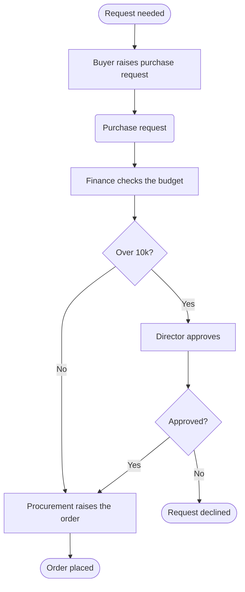

# Flow Modeling

Turn a sentence about how work happens into a flowchart. The result is a
picture of a business process, not a program: nothing in it runs.

## In IQ Compiler

IQ Workflow draws conceptual diagrams. It has no scheduler, no runtime and no
connectors. A diagram is a shared picture of how work moves, which people read,
argue about and correct.

The surface parses your Mermaid and lays the shapes on its canvas. So the
answer has to be **exactly one fenced `mermaid` block**, and nothing else the
user needs. If you want to explain a choice, put it in the prose around the
block, never inside it.

## The five shapes

The canvas has seven kinds. Five of them appear in Mermaid; the other two do
not survive export, so do not write them.

| Shape | Mermaid | Use it for |
|---|---|---|
| Stadium | `id([Text])` | where the flow begins, and each outcome |
| Box | `id[Text]` | someone or something does work |
| Diamond | `id{Text}` | a branch — the arrows carry the answers |
| Subroutine | `id[[Text]]` | a process described somewhere else |
| Round | `id(Text)` | a document, record or dataset |

Rules that keep a diagram readable on the canvas:

- Open with `flowchart TD`. Top-down matches the way the canvas lays out ranks.
- The **first** stadium is the start. Every later stadium is an outcome.
- Give every node a short id (`a`, `b`, `c1`) and put the words in the brackets.
- Label every arrow leaving a diamond: `d -->|Approved| e`. An unlabelled
  branch is the commonest thing a reader asks you to fix.
- A diamond needs at least two arrows out. One arrow is not a decision.
- Reach every node. A node nothing points at is a mistake, not a hint.
- End on at least one stadium. A flow with no outcome is unfinished.
- Use `-.->` for a link that is an aside rather than a step of the work.
- Keep labels short — three to six words. Detail belongs in the node's config
  fields (owner, system, duration, notes), which the user fills in afterwards.

## What not to write

- **No subgraphs and no swimlanes.** Who does the work is a text field on the
  step, not a container around it. Write `Buyer raises PO`, not a `subgraph
  Buyer`.
- **No styling** — no `style`, `classDef`, `class`, `linkStyle`, `click`, or
  `%%{init}%%`. The canvas owns how it looks.
- **No other diagram types.** Not `sequenceDiagram`, not `stateDiagram`, not
  `gantt`. They do not parse onto this canvas.
- **No notes.** The `note` kind exists on the canvas but is deliberately not
  exported, so an annotation written in Mermaid is lost.
- **No parallel-gateway notation.** Two arrows out of one box already mean two
  things happen; there is no join symbol to close them.

## How to build one

1. **Find the trigger.** What has to be true for this work to begin? That is
   the first stadium.
2. **List the work in order.** One box per step, phrased as
   `<who or what> <does what>` — `Security reviews the advisory`, not `Review`.
3. **Find the questions.** Anywhere the path forks, put a diamond and name the
   answers on the arrows.
4. **Name the outcomes.** Every path has to reach a stadium. Include the
   unhappy ones: rejected, withdrawn, escalated.
5. **Add the things being handled.** A document, record or dataset each step
   produces or consumes goes in a round node.
6. **Check it against the rules above** before you answer.

## Example

A user says: *the buyer raises a purchase request, finance checks the budget,
anything over 10k goes to the director, then procurement raises the order.*

Every stadium after the first is an outcome. Both diamonds have labelled
arrows. `Request declined` is there because a real process has an unhappy path
and a diagram that hides it is not describing the process.

## When the description is thin

Draw what was said and name the gaps in the prose under the block. Do not
invent approval steps, systems or thresholds that the user did not mention —
a diagram that quietly adds a control is worse than one that is short.
